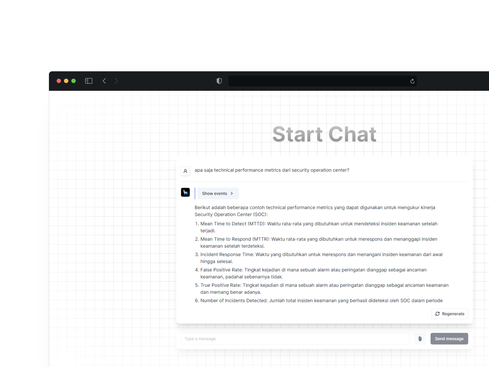
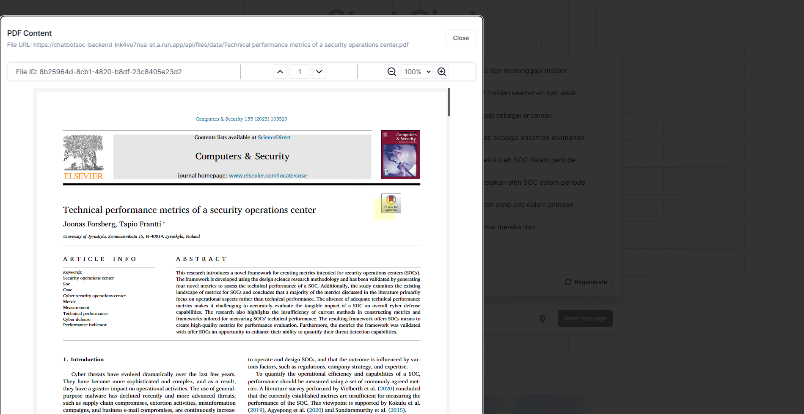

## FP Manajemen Insiden - Kelompok 5

### App Design





First, startup the backend as described in the [backend README](./backend/README.md).

Second, run the development server of the frontend as described in the [frontend README](./frontend/README.md).

> Create .env from .env.example template
```env
# The Llama Cloud API key.
# LLAMA_CLOUD_API_KEY=

# The provider for the AI models to use.
MODEL_PROVIDER=openai

# The name of LLM model to use.
MODEL=gpt-3.5-turbo

# Name of the embedding model to use.
EMBEDDING_MODEL=text-embedding-3-large

# Dimension of the embedding model to use.
EMBEDDING_DIM=1024

# The questions to help users get started (multi-line).
# CONVERSATION_STARTERS=

# The OpenAI API key to use.
OPENAI_API_KEY=YOUR_API_KEY

# Temperature for sampling from the model.
# LLM_TEMPERATURE=

# Maximum number of tokens to generate.
# LLM_MAX_TOKENS=

# The number of similar embeddings to return when retrieving documents.
TOP_K=3

# The time in milliseconds to wait for the stream to return a response.
STREAM_TIMEOUT=60000

# FILESERVER_URL_PREFIX is the URL prefix of the server storing the images generated by the interpreter.
FILESERVER_URL_PREFIX=http://localhost:8000/api/files

# The system prompt for the AI model.
SYSTEM_PROMPT=You are a helpful assistant who helps users with their questions.
```

## Alternative LLM Models
- OpenAI Alternative models
  - https://platform.openai.com/docs/models
- Gemini API
  - https://aistudio.google.com/app/apikey
